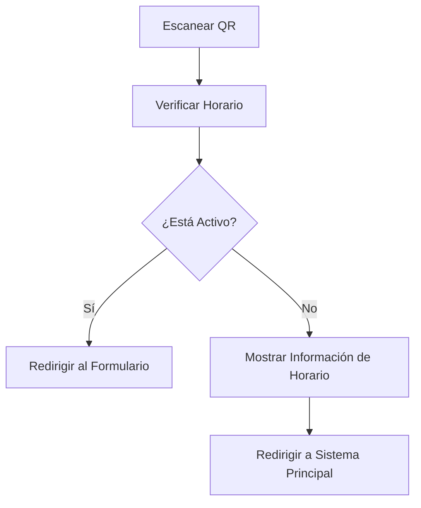

# 🔥 Sistema QR Programable
### Control Inteligente de Formularios con Horarios Automatizados


> **🚀 Sistema avanzado de códigos QR dinámicos con control de horarios automatizado y panel de administración securizado.**

---

## 📋 Tabla de Contenidos

- [🎯 Características Principales](#-características-principales)
- [🛠️ Tecnologías Utilizadas](#️-tecnologías-utilizadas)
- [⚡ Instalación Rápida](#-instalación-rápida)
- [🚀 Uso del Sistema](#-uso-del-sistema)
- [⚙️ Configuración](#️-configuración)
- [🔒 Panel de Administración](#-panel-de-administración)
- [📱 QR Codes Inteligentes](#-qr-codes-inteligentes)
- [🌐 Estructura del Proyecto](#-estructura-del-proyecto)
- [🔧 Personalización](#-personalización)
- [🚀 Despliegue](#-despliegue)
- [📞 Soporte](#-soporte)
- [👨‍💻 Autor](#-autor)

---

## 🎯 Características Principales

### ✨ **QR Codes Dinámicos**
- **38 códigos QR personalizados** para diferentes formularios
- **Redirección inteligente** basada en horarios programados
- **Descarga en alta resolución** (500x500px) con diseño premium
- **Estado visual en tiempo real** (activo/inactivo)

### ⏰ **Control de Horarios Automatizado**
- **Horario configurable**: Lunes a Viernes, 8:00 AM - 3:00 PM
- **Zona horaria**: Bogotá, Colombia (UTC-5)
- **Verificación en tiempo real** cada 30 segundos
- **Redirección automática** fuera de horario

### 🔐 **Panel de Administración Seguro**
- **Autenticación multiclave** con 4 claves diferentes
- **Sistema anti-fuerza bruta** (3 intentos + bloqueo temporal)
- **Configuración en vivo** de horarios y días
- **Vista previa de cambios** antes de guardar

### 🎨 **Interfaz Premium**
- **Diseño responsive** adaptable a todos los dispositivos
- **Animaciones CSS avanzadas** y efectos visuales
- **Tema moderno** con gradientes y glassmorphism
- **UX/UI profesional** con feedback visual

### 📊 **Dashboard en Tiempo Real**
- **Estado del sistema** con indicadores visuales
- **Estadísticas de uso** y métricas
- **Horarios de operación** claramente definidos
- **Próximos horarios disponibles**

---

## 🛠️ Tecnologías Utilizadas

### **Frontend Core**
```json
{
  "react": "^18.2.0",
  "react-dom": "^18.2.0",
  "react-router-dom": "^6.8.0"
}
```

### **QR & Icons**
```json
{
  "qrcode.react": "^3.1.0",
  "lucide-react": "^0.263.1"
}
```

### **Styling**
```json
{
  "tailwindcss": "^3.2.0",
  "autoprefixer": "^10.4.13",
  "postcss": "^8.4.21"
}
```

### **Build Tools**
```json
{
  "@vitejs/plugin-react": "^4.0.0",
  "vite": "^4.0.0"
}
```

---

## ⚡ Instalación Rápida

### **Prerrequisitos**
- Node.js (v16 o superior)
- npm o yarn
- Git

### **Paso 1: Clonar el Repositorio**
```bash
git clone https://github.com/BryanCodeDev/sistema-qr-programable.git
cd sistema-qr-programable
```

### **Paso 2: Instalar Dependencias**
```bash
# Con npm
npm install

# Con yarn
yarn install
```

### **Paso 3: Configurar Entorno**
```bash
# Crear archivo de variables de entorno
cp .env.example .env

# Editar configuraciones si es necesario
nano .env
```

### **Paso 4: Iniciar Desarrollo**
```bash
# Con npm
npm run dev

# Con yarn
yarn dev
```

**🎉 ¡Listo! El sistema estará disponible en `http://localhost:3000`**

---

## 🚀 Uso del Sistema

### **Para Usuarios Finales:**
1. **Escanear QR**: Usar cualquier app de cámara o lector QR
2. **Redirección Automática**: El sistema verifica horarios automáticamente
3. **Acceso Inmediato**: Si está en horario, redirección instantánea al formulario
4. **Información Clara**: Si está fuera de horario, muestra cuándo estará disponible

### **Para Administradores:**
1. **Acceder al Panel**: Clic en el botón ⚙️ (esquina inferior derecha)
2. **Autenticación**: Ingresar una de las 4 claves disponibles
3. **Configurar Horarios**: Cambiar horas de inicio/fin y días activos
4. **Vista Previa**: Verificar cambios antes de guardar
5. **Guardar**: Aplicar configuración temporal

---

## ⚙️ Configuración

### **📅 Horarios del Sistema**
```javascript
// src/config/scheduleConfig.js
const SCHEDULE_CONFIG = {
  START_HOUR: 8,    // 8:00 AM
  END_HOUR: 15,     // 3:00 PM
  TIMEZONE: 'America/Bogota',
  ACTIVE_DAYS: [1, 2, 3, 4, 5], // Lunes a Viernes
  CHECK_INTERVAL_SECONDS: 30,
};
```

### **📝 Formularios**
```javascript
// src/config/formsConfig.js
export const FORM_CONFIGS = [
  { 
    id: 1, 
    name: 'Antidoto – 300 9741660', 
    url: 'https://forms.gle/7AdMT5JaHzjQBquK6' 
  },
  // ... más formularios
];
```

### **🎨 Personalización de Estilos**
```css
/* src/styles/index.css */
/* Personalizar colores principales */
:root {
  --primary-color: #3B82F6;
  --secondary-color: #8B5CF6;
  --success-color: #10B981;
  --danger-color: #EF4444;
}
```

---

## 🔒 Panel de Administración

### **🔑 Claves de Acceso**
```javascript
const ADMIN_KEYS = [
  'mastercode2025',
  'admin2025qr',
  'gestor2025',
  'bryan2025'
];
```

### **🛡️ Características de Seguridad**
- **3 intentos máximos** antes del bloqueo
- **60 segundos de bloqueo** temporal
- **Múltiples claves válidas** para flexibilidad
- **Logout automático** al cerrar

### **⚙️ Configuraciones Disponibles**
- **Hora de Inicio**: 0-23 horas (formato 24h)
- **Hora de Fin**: 0-23 horas (formato 24h)
- **Días Activos**: Selección múltiple (Dom-Sáb)
- **Vista Previa**: Verificar configuración antes de guardar

---

## 📱 QR Codes Inteligentes

### **🔄 Funcionamiento**


### **🎯 URLs de Redirección**
- **Desarrollo**: `http://localhost:3000/qr/{formId}`
- **Producción**: `https://tu-dominio.com/qr/{formId}`

### **📥 Descarga de QR**
- **Resolución**: 500x500px (alta calidad)
- **Formato**: PNG con fondo blanco
- **Información**: Nombre del formulario + ID
- **Marca**: Logo de MasterCode Company

---

## 🌐 Estructura del Proyecto

```
sistema-qr-programable/
├── 📁 public/
│   ├── index.html
│   └── favicon.ico
├── 📁 src/
│   ├── 📁 components/          # Componentes React
│   │   ├── AdminPanel.jsx      # Panel de administración
│   │   ├── Header.jsx          # Cabecera del sistema
│   │   ├── Footer.jsx          # Pie de página
│   │   ├── QRComponent.jsx     # Componente QR individual
│   │   └── StatusBar.jsx       # Barra de estado
│   ├── 📁 config/              # Configuraciones
│   │   ├── formsConfig.js      # Lista de formularios
│   │   └── scheduleConfig.js   # Configuración de horarios
│   ├── 📁 hooks/               # Custom Hooks
│   │   └── useScheduleCheck.js # Hook de verificación de horarios
│   ├── 📁 pages/               # Páginas de la aplicación
│   │   └── QRRedirect.jsx      # Página de redirección QR
│   ├── 📁 styles/              # Estilos CSS
│   │   └── index.css           # Estilos principales
│   ├── App.jsx                 # Componente principal
│   └── index.js                # Punto de entrada
├── package.json
├── tailwind.config.js
├── vite.config.js
└── README.md
```

---

## 🔧 Personalización

### **🎨 Cambiar Colores del Tema**
```css
/* src/styles/index.css */
.bg-primary {
  background: linear-gradient(135deg, #667eea 0%, #764ba2 100%);
}

.text-primary {
  color: #3B82F6;
}
```

### **📝 Agregar Nuevos Formularios**
```javascript
// src/config/formsConfig.js
export const FORM_CONFIGS = [
  // ... formularios existentes
  { 
    id: 39, 
    name: 'Nuevo Formulario', 
    url: 'https://forms.gle/NUEVO_ENLACE' 
  },
];
```

### **⏰ Modificar Horarios**
```javascript
// src/config/scheduleConfig.js
const SCHEDULE_CONFIG = {
  START_HOUR: 9,    // Cambiar a 9:00 AM
  END_HOUR: 17,     // Cambiar a 5:00 PM
  ACTIVE_DAYS: [1, 2, 3, 4, 5, 6], // Incluir sábados
};
```

### **🔑 Actualizar Claves de Admin**
```javascript
// src/components/AdminPanel.jsx
const ADMIN_KEYS = [
  'tu_nueva_clave_2025',
  'password_seguro',
  'admin_key',
];
```

---

## 🚀 Despliegue

### **📦 Build de Producción**
```bash
# Crear build optimizado
npm run build

# Previsualizar build
npm run preview
```

### **🌐 Netlify (Recomendado)**
```bash
# Instalar Netlify CLI
npm install -g netlify-cli

# Deploy
netlify deploy --prod --dir=dist
```

### **🔧 Variables de Entorno**
```env
# .env.production
REACT_APP_BASE_URL=https://tu-dominio.com
REACT_APP_ENVIRONMENT=production
```

### **🛠️ Configuración de Netlify**
```toml
# netlify.toml
[build]
  publish = "dist"
  command = "npm run build"

[[redirects]]
  from = "/*"
  to = "/index.html"
  status = 200
```

---

## 📈 Características Avanzadas

### **🔄 Auto-actualización de Estado**
- Verificación automática cada 30 segundos
- Cambio de estado sin recargar página
- Sincronización con zona horaria de Bogotá

### **💾 Gestión de Estado**
- React Hooks para estado local
- Context API para estado global (futuro)
- Persistencia temporal en memoria

### **🎯 Optimizaciones**
- Componentes memoizados con React.memo
- Lazy loading para optimización
- CSS minificado en producción

### **🔒 Seguridad**
- Validación de entrada en formularios
- Sanitización de URLs
- Protección contra ataques de fuerza bruta

---

## 🐛 Solución de Problemas

### **❌ QR No Funciona**
1. Verificar que la URL sea correcta
2. Comprobar conexión a internet
3. Validar configuración de horarios

### **🔐 Panel Admin No Abre**
1. Verificar que las claves sean correctas
2. Esperar si está en bloqueo temporal
3. Revisar consola del navegador

### **⏰ Horarios Incorrectos**
1. Verificar zona horaria del sistema
2. Comprobar configuración en `scheduleConfig.js`
3. Refrescar página para sincronizar

---

## 📊 Métricas y Analytics

### **📈 Estadísticas del Sistema**
- **38 formularios** configurados
- **Disponibilidad 24/7** con restricciones horarias
- **Calidad HD** en descargas de QR
- **Descargas ilimitadas** en horario activo

### **🎯 KPIs Monitoreados**
- Tiempo de respuesta de redirección
- Tasa de éxito de descargas
- Intentos de acceso fuera de horario
- Uso del panel de administración

---

## 🔄 Roadmap Futuro

### **v2.0 - Próximas Funcionalidades**
- [ ] **Analytics Dashboard** con métricas avanzadas
- [ ] **Base de datos** para persistencia de configuración
- [ ] **API REST** para gestión remota
- [ ] **Notificaciones push** para cambios de estado
- [ ] **Múltiples zonas horarias** simultáneas
- [ ] **Temas personalizables** dark/light mode
- [ ] **Exportación masiva** de QR codes
- [ ] **Integración con CRM** para seguimiento

### **v2.1 - Mejoras de Seguridad**
- [ ] **Autenticación JWT** para panel admin
- [ ] **Logs de actividad** detallados
- [ ] **Backup automático** de configuraciones
- [ ] **Rate limiting** para prevenir spam

---

## 🤝 Contribuciones

### **🛠️ Cómo Contribuir**
1. **Fork** el repositorio
2. **Crear rama** para nueva funcionalidad (`git checkout -b feature/AmazingFeature`)
3. **Commit** cambios (`git commit -m 'Add some AmazingFeature'`)
4. **Push** a la rama (`git push origin feature/AmazingFeature`)
5. **Abrir Pull Request**

### **📋 Guidelines**
- Seguir estándares de código establecidos
- Agregar tests para nuevas funcionalidades
- Actualizar documentación cuando sea necesario
- Probar en múltiples dispositivos

---

## 📜 Licencia

```
MIT License

Copyright (c) 2025 MasterCode Company

Permission is hereby granted, free of charge, to any person obtaining a copy
of this software and associated documentation files (the "Software"), to deal
in the Software without restriction, including without limitation the rights
to use, copy, modify, merge, publish, distribute, sublicense, and/or sell
copies of the Software, and to permit persons to whom the Software is
furnished to do so, subject to the following conditions:

The above copyright notice and this permission notice shall be included in all
copies or substantial portions of the Software.

THE SOFTWARE IS PROVIDED "AS IS", WITHOUT WARRANTY OF ANY KIND, EXPRESS OR
IMPLIED, INCLUDING BUT NOT LIMITED TO THE WARRANTIES OF MERCHANTABILITY,
FITNESS FOR A PARTICULAR PURPOSE AND NONINFRINGEMENT.
```

---

## 📞 Soporte

### **🆘 Obtener Ayuda**
- **📧 Email**: mastercodecompany@gmail.com
- **🌐 Website**: https://mastercodecompany.com
- **💬 GitHub Issues**: Para reportar bugs
- **📞 WhatsApp**: +57 XXX XXX XXXX (solo emergencias)

### **📋 Soporte Incluido**
- ✅ **30 días** de soporte gratuito
- ✅ **Corrección de bugs** sin costo adicional
- ✅ **Manual de usuario** detallado
- ✅ **Documentación técnica** completa

### **🕐 Horarios de Atención**
- **Lunes a Viernes**: 8:00 AM - 6:00 PM
- **Sábados**: 9:00 AM - 1:00 PM
- **Domingos**: Solo emergencias
- **Zona Horaria**: Bogotá, Colombia (UTC-5)

---

## 👨‍💻 Autor

<div align="center">

### **Bryan Santiago Muñoz Romero**
**CEO & Founder - MasterCode Company**  
**Tecnólogo en Análisis y Desarrollo de Software**

[](https://github.com/BryanCodeDev)
[](mailto:mastercodecompany@gmail.com)
[](https://mastercodecompany.com)
[](https://linkedin.com/in/bryan-munoz-dev)

</div>

### **🎯 Especialidades**
- **Full Stack Development**: React, Next.js, Node.js, Python
- **Automatizaciones**: CRMs, Chatbots, WhatsApp Integration
- **Cloud & DevOps**: AWS, Docker, Microservicios
- **Databases**: MySQL, PostgreSQL, MongoDB

### **🏆 Experiencia**
- **+1 año** en desarrollo de software
- **Fundador** de MasterCode Company
- **Especialista** en soluciones empresariales
- **Certificado** por SENA Colombia

---

## 📈 Stats del Proyecto

<div align="center">


</div>

---

<div align="center">

## ⭐ ¡Si te gusta este proyecto, dale una estrella! ⭐

**Hecho con ❤️ en Colombia 🇨🇴**

---

*© 2025 MasterCode Company - Todos los derechos reservados*  
*Soluciones Tecnológicas Innovadoras*

</div>